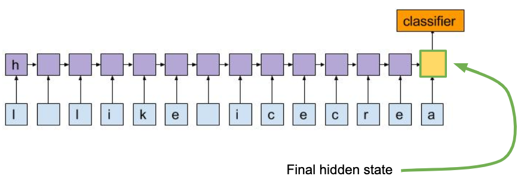

# FrnnMUTE: French RNN Medical Understandability Text Embeddings
This repo contains the pre-trained French RNN Medical Understandability Text Embeddings related to the following paper:

Pylieva, Hanna, Artem Chernodub<sup>1,2</sup>, Natalia Grabar<sup>3</sup> , and Thierry Hamon<sup>4,5</sup>. "RNN Embeddings for Identifying Difficult to Understand Medical Words." In Proceedings of the 18th BioNLP Workshop and Shared Task, pp. 97-104. 2019.

If you use the FrnnMUTE or would like to refer to it, please cite the paper mentioned above. You can also use the following BibTex information for citation:
```
@inproceedings{pylieva-etal-2019-rnn,
    title = "{RNN} Embeddings for Identifying Difficult to Understand Medical Words",
    author = "Pylieva, Hanna  and
      Chernodub, Artem  and
      Grabar, Natalia  and
      Hamon, Thierry",
    booktitle = "Proceedings of the 18th BioNLP Workshop and Shared Task",
    month = aug,
    year = "2019",
    address = "Florence, Italy",
    publisher = "Association for Computational Linguistics",
    url = "https://www.aclweb.org/anthology/W19-5011",
    pages = "97--104"
}
```

FrnnMUTE were trained on manual annotations of French medical words, available by link: http://natalia.grabar.free.fr/resources.php#rated  
We used the annotations of A1 annotator for training. Note that in the master thesis the annotators O1, O2, O3 are in fact annotators A1, A2, A3 in the dataset available by link (just different names).

How FrnnMUTE were received:
1. We pre-trained character-level LSTM on target difficult for understanding words categorization task.
2. Last hidden state of the pre-trained RNN is 50-dimensional words' representation which are FrnnMUTE.


To read FrnnMUTE using Python from the file in this project:
```
import pickle
frnnmute= pickle.load(open('dict_rnn_embs.pkl', 'rb'))
```


[1] Ukrainian Catholic University, Faculty of Applied Sciences,
Kozelnytska st. 2a, Lviv, Ukraine  
[2] Grammarly  
[3] CNRS, Univ. Lille, UMR 8163 - STL - Savoirs Textes Langage, F-59000, Lille, France  
[4] LIMSI, CNRS, Université Paris-Saclay, F-91405 Orsay, France  
[5] Université Paris 13, Sorbonne Paris Cité, F-93430, Villetaneuse, France  

Contact: [hanna.pylieva@gmail.com](mailto:hanna.pylieva@gmail.com)
